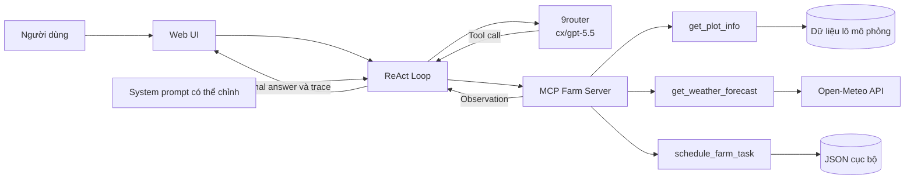

# Sườn trình bày dự án Trợ lý AI nông nghiệp cho cây cà phê

## Thông tin bài trình bày

- **Học viên:** Đoàn Quang Thắng
- **Mã học viên:** 02395
- **Tên dự án:** Trợ lý AI nông nghiệp thử nghiệm trên cây cà phê
- **Thời lượng đề xuất:** 7 đến 9 phút
- **Mục tiêu demo:** Chứng minh Agent có thể tự chọn công cụ, sử dụng kết quả thực tế để xử lý nhiều bước và hiển thị toàn bộ trace trên UI.

## Mở đầu trong 20 giây

**Lời trình bày gợi ý:**

> Em xây dựng một trợ lý AI nông nghiệp và triển khai thử nghiệm trên cây cà phê. Hệ thống hỗ trợ tra cứu thông tin lô, lấy dự báo thời tiết và ghi lịch chăm sóc như tưới, bón phân hoặc phun thuốc. Điểm chính của bài là Agent không chỉ trả lời văn bản mà còn tự chọn và gọi công cụ qua MCP, sau đó dùng kết quả để quyết định bước tiếp theo.

## 1 Chọn đề tài gì và tại sao chọn

### Đề tài

Trợ lý AI hỗ trợ quản lý và chăm sóc vườn cà phê, tập trung vào ba nhu cầu:

1. Tra cứu thông tin lô cà phê.
2. Xem dự báo thời tiết tại đúng vị trí của lô.
3. Ghi lịch công việc như kiểm tra tưới, tưới nước, bón phân hoặc phun thuốc.

### Lý do chọn

- Công việc chăm sóc cà phê phụ thuộc vào nhiều nguồn dữ liệu, đặc biệt là vị trí lô và thời tiết.
- Một yêu cầu của người dùng thường gồm nhiều bước liên tiếp, ví dụ tìm lô, lấy tọa độ, xem dự báo rồi mới đề xuất thời điểm.
- Bài toán có cả thao tác đọc dữ liệu và thao tác tạo dữ liệu, phù hợp để minh họa sự khác nhau giữa Chatbot và Agent.
- Phạm vi đủ nhỏ để demo trong bài lab nhưng có thể mở rộng sang cảm biến đất, nhận diện bệnh cây và quản lý nhiều loại cây trồng.

**Lời trình bày gợi ý:**

> Em chọn nông nghiệp vì đây là bài toán có dữ liệu thay đổi theo thời gian và cần hành động thực tế. Cây cà phê được dùng làm phạm vi thử nghiệm. Trong bản lab, dữ liệu lô là mô phỏng, dự báo thời tiết lấy từ Open-Meteo và lịch công việc được lưu cục bộ bằng JSON.

## 2 Tại sao ReAct Agent phù hợp

### Bảng Agentic Fit

| Tiêu chí | Điểm | Giải thích ngắn |
| --- | :---: | --- |
| Multi step Reasoning | 4 trên 5 | Agent phải tra cứu lô, lấy tọa độ, xem dự báo rồi mới đề xuất hoặc ghi lịch. |
| Tool Interaction | 5 trên 5 | Hệ thống cần đọc dữ liệu lô, gọi API thời tiết và ghi lịch công việc. |
| Dynamic Decision | 4 trên 5 | Bước sau phụ thuộc vào kết quả bước trước; lô không tồn tại hoặc API lỗi thì Agent phải dừng và báo đúng. |
| Long Horizon Goal | 2 trên 5 | Agent giữ mục tiêu trong một phiên hội thoại nhưng chưa tự theo dõi vườn hoặc cập nhật lịch dài hạn. |
| **Tổng** | **15 trên 20** | Bài toán phù hợp với ReAct Agent. |

### So sánh ngắn với Chatbot

Chatbot có thể giải thích khái niệm chăm sóc cà phê nhưng không biết trạng thái lô hiện tại, không lấy được dự báo mới và không ghi lịch. ReAct Agent có thể quan sát kết quả công cụ rồi tiếp tục xử lý.

**Lời trình bày gợi ý:**

> Em chấm 15 trên 20. Tiêu chí mạnh nhất là Tool Interaction vì hệ thống phải kết nối ba nguồn chức năng. Long Horizon chỉ đạt 2 trên 5 vì bản lab chưa chạy tự động trong nhiều ngày. Việc chấm đúng phạm vi giúp em không phóng đại khả năng hiện tại của hệ thống.

## 3 Kiến trúc Agent đã xây dựng



### Luồng xử lý

1. Người dùng nhập câu hỏi trên UI.
2. UI gửi câu hỏi, system prompt và lịch sử phiên vào ReAct Loop.
3. LLM qua 9router quyết định trả lời trực tiếp hoặc đề xuất tool call.
4. MCP Server kiểm tra tham số và gọi đúng tool.
5. Observation được trả lại cho LLM để quyết định bước tiếp theo.
6. UI hiển thị tool đang chạy, tham số, trạng thái Observation và câu trả lời cuối.

### Các kiểm soát chính

- Tối đa 8 vòng lặp để tránh Agent chạy vô hạn.
- Lỗi LLM không tự chuyển sang Mock trong lúc nghiệm thu.
- Lịch chỉ được ghi khi người dùng bật quyền cho đúng lượt đó.
- `SUCCESS` mới được thông báo là đã ghi lịch.
- Không tự chọn thuốc, liều lượng hoặc khẳng định an toàn phun chỉ dựa trên thời tiết.

**Lời trình bày gợi ý:**

> UI là nơi người dùng tương tác và đồng thời là màn hình quan sát. ReAct Loop gọi LLM qua 9router. Khi LLM chọn tool, yêu cầu đi qua MCP Farm Server. Kết quả tool được đưa ngược lại vào lịch sử để LLM tiếp tục suy luận và tạo câu trả lời cuối.

## 4 Các tool và tác dụng

| Tool | Đầu vào chính | Tác dụng | Nguồn dữ liệu |
| --- | --- | --- | --- |
| `get_plot_info` | `plot_id` | Tra cứu tên lô, tỉnh, tọa độ, giống cà phê và giai đoạn sinh trưởng. | Dữ liệu mô phỏng trong bài lab |
| `get_weather_forecast` | `latitude`, `longitude`, `days` | Lấy nhiệt độ, độ ẩm, xác suất mưa, lượng mưa, tốc độ gió và gió giật theo giờ. | Open-Meteo API |
| `schedule_farm_task` | `plot_id`, `task_type`, `scheduled_at`, `notes` | Ghi lịch chăm sóc, trả mã công việc và ngăn tạo lịch trùng. | JSON cục bộ |

**Điểm cần nói rõ:** MCP trong bài là lớp mô phỏng chạy cùng tiến trình theo giao diện của CODELAB. Bản hiện tại chưa triển khai MCP transport và handshake đầy đủ qua mạng.

**Lời trình bày gợi ý:**

> Tool đầu tiên cung cấp tọa độ lô. Tool thứ hai dùng tọa độ đó để lấy dự báo thật. Tool thứ ba tạo hành động có trạng thái bằng cách lưu lịch vào JSON. Việc tách tool giúp LLM không cần tự bịa dữ liệu và mỗi thao tác đều có Observation để kiểm tra.

## 5 Kịch bản demo trực tiếp

### Chuẩn bị trước khi demo

1. Mở 9router và kiểm tra model `cx/gpt-5.5` có hỗ trợ tool calling.
2. Kiểm tra UI hiển thị `NineRouterProvider` và model `cx/gpt-5.5` ở góc trên.
3. Chạy giao diện:

```bash
.venv/bin/python src/web_server.py --port 8080
```

4. Mở `http://127.0.0.1:8080`.
5. Để khu vực Agent trace trong tầm nhìn khi trình bày.
6. Không hiển thị file `.env` hoặc API key trên màn hình.

### Câu demo 1 Tra cứu lô và xem thời tiết

**Nhập trên UI:**

> Tra cứu lô CF001 và xem dự báo 3 ngày tới để đề xuất thời điểm phun thuốc. Tôi chưa chọn sản phẩm và chưa chốt giờ; chưa tạo lịch.

**Trace mong đợi:**

```text
User query
  → LLM
  → get_plot_info(plot_id="CF001")
  → Observation: SUCCESS, nhận tọa độ 12.6667 và 108.05
  → LLM
  → get_weather_forecast(latitude=12.6667, longitude=108.05, days=3)
  → Observation: SUCCESS, nhận dự báo Open-Meteo
  → LLM
  → Final answer: tóm tắt dự báo, đề xuất khung giờ và hỏi thông tin còn thiếu
```

**Điểm cần chỉ trên UI:**

- Tool nào đang chạy.
- Tham số lấy từ kết quả của bước trước.
- Observation có nguồn `LIVE_API` đối với thời tiết.
- Agent không gọi `schedule_farm_task` vì người dùng nói chưa tạo lịch.
- Câu trả lời không tự chọn thuốc hoặc liều lượng.

### Câu demo 2 Ghi lịch công việc

Trước khi gửi, bật **Cho phép ghi lịch trong lượt này**.

**Nhập trên UI:**

> Ghi lịch kiểm tra hệ thống tưới cho lô CF001 lúc 07:00 ngày mai, ghi chú kiểm tra đầu tưới bị tắc.

**Trace mong đợi:**

```text
User query
  → LLM
  → schedule_farm_task(
      plot_id="CF001",
      task_type="irrigation_inspection",
      scheduled_at="thời gian ISO 8601 có múi giờ +07:00",
      notes="kiểm tra đầu tưới bị tắc"
    )
  → Observation: SUCCESS và có task_id
  → LLM
  → Final answer: xác nhận đã lưu lịch cục bộ và trả mã công việc
```

**Điểm cần chỉ trên UI:**

- Quyền ghi lịch chỉ bật cho một lượt và tự tắt sau khi gửi.
- Observation phải là `SUCCESS` và có `task_id`.
- Hệ thống chỉ ghi dữ liệu vào JSON; chưa điều khiển thiết bị ngoài vườn.

### Câu hỏi dự phòng khi cần minh họa xử lý lỗi

> Tra cứu lô CF999 và ghi lịch kiểm tra hệ thống tưới lúc 07:00 ngày mai.

Kết quả đúng là `NOT_FOUND`, Agent hỏi lại mã lô và không gọi tool ghi lịch. Tình huống này chứng minh Agent không bịa thông tin khi dữ liệu không tồn tại.

## Thao tác chỉnh system prompt trên UI

Nếu còn thời gian, thêm một dòng ngắn vào cuối system prompt:

```text
Khi dùng dữ liệu thời tiết, hãy kết thúc câu trả lời bằng một dòng ghi rõ nguồn và thời điểm truy xuất.
```

Sau đó chạy lại câu demo 1 và chỉ ra phần trả lời đã thay đổi. Không xóa các quy tắc kiểm soát việc ghi lịch và sử dụng thuốc trong prompt mặc định.

## Kết luận trong 30 giây

**Lời trình bày gợi ý:**

> Qua demo, hệ thống đã thể hiện khác biệt giữa Chatbot và ReAct Agent: Agent tự chọn tool, sử dụng Observation để xử lý nhiều bước và thực hiện hành động có kiểm soát. Phạm vi hiện tại là dữ liệu lô mô phỏng, thời tiết thật và lịch cục bộ. Hướng phát triển tiếp theo là kết nối dữ liệu cảm biến, nguồn dữ liệu vườn thật và cơ chế theo dõi kế hoạch chăm sóc dài hạn.

## Checklist trước khi lên trình bày

- [ ] 9router đang chạy và endpoint `http://localhost:20128/v1` phản hồi.
- [ ] Model `cx/gpt-5.5` hỗ trợ native tool calling qua Chat Completions.
- [ ] `NINE_ROUTER_API_KEY` đã cấu hình trong `.env` và không xuất hiện trên màn hình.
- [ ] Chạy thử hai câu demo trước buổi trình bày.
- [ ] Trace câu demo 1 có đúng thứ tự `get_plot_info` rồi `get_weather_forecast`.
- [ ] Câu demo 1 không tạo lịch.
- [ ] Câu demo 2 trả `SUCCESS`, có `task_id` và lịch tồn tại trong JSON.
- [ ] Có sẵn một trace live đã kiểm tra để trình bày nếu mạng hoặc router gặp lỗi.
- [ ] Nói rõ dữ liệu lô là mô phỏng và MCP là mô phỏng trong tiến trình.
- [ ] Không tuyên bố Agent tự chọn thuốc, liều lượng hoặc bảo đảm điều kiện phun an toàn.

## Phân bổ thời gian gợi ý

| Nội dung | Thời lượng |
| --- | :---: |
| Mở đầu và lý do chọn đề tài | 1 phút |
| Agentic Fit | 1 phút 30 giây |
| Kiến trúc | 1 phút 30 giây |
| Giới thiệu tool | 1 phút |
| Demo hai câu hỏi và trace | 3 phút |
| Kết luận | 30 giây |
| **Tổng** | **8 phút 30 giây** |
